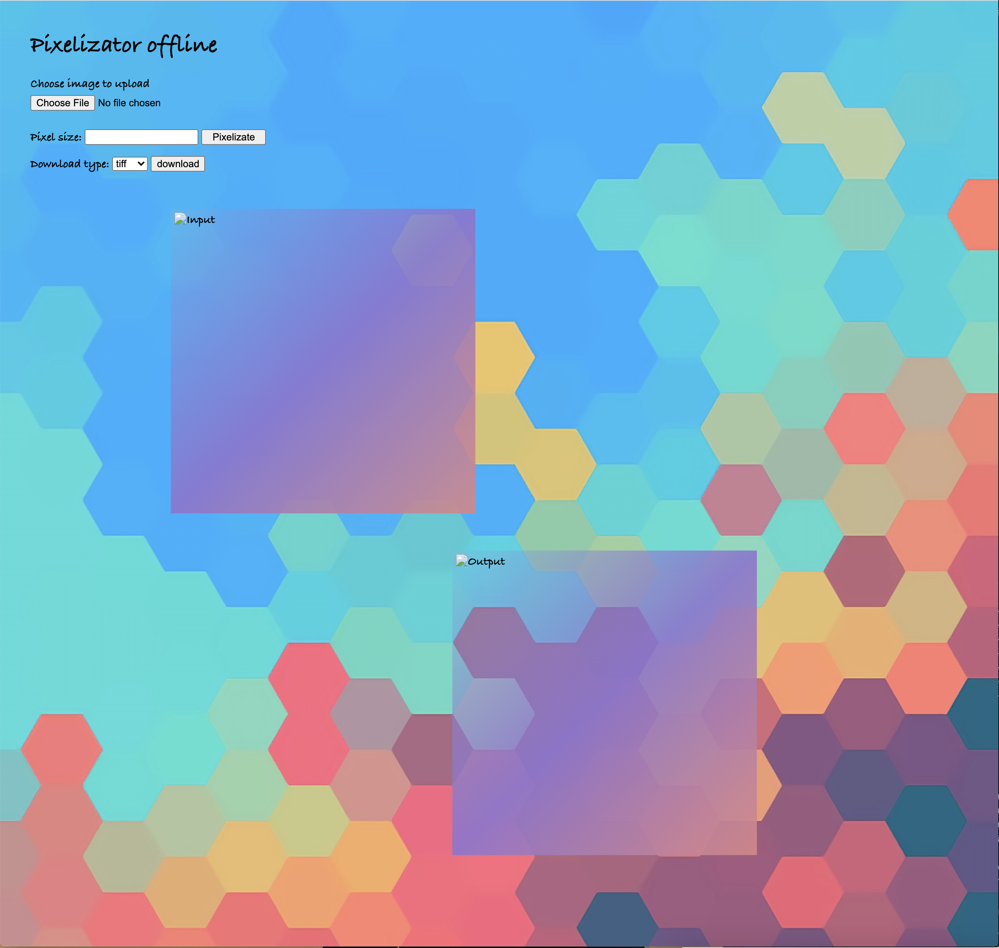
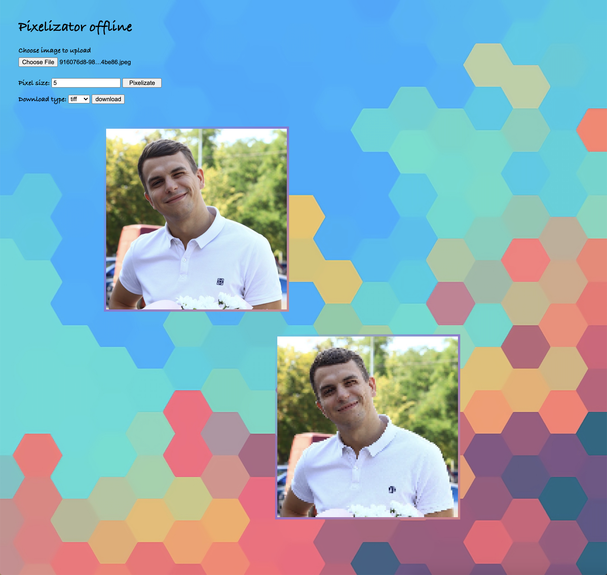
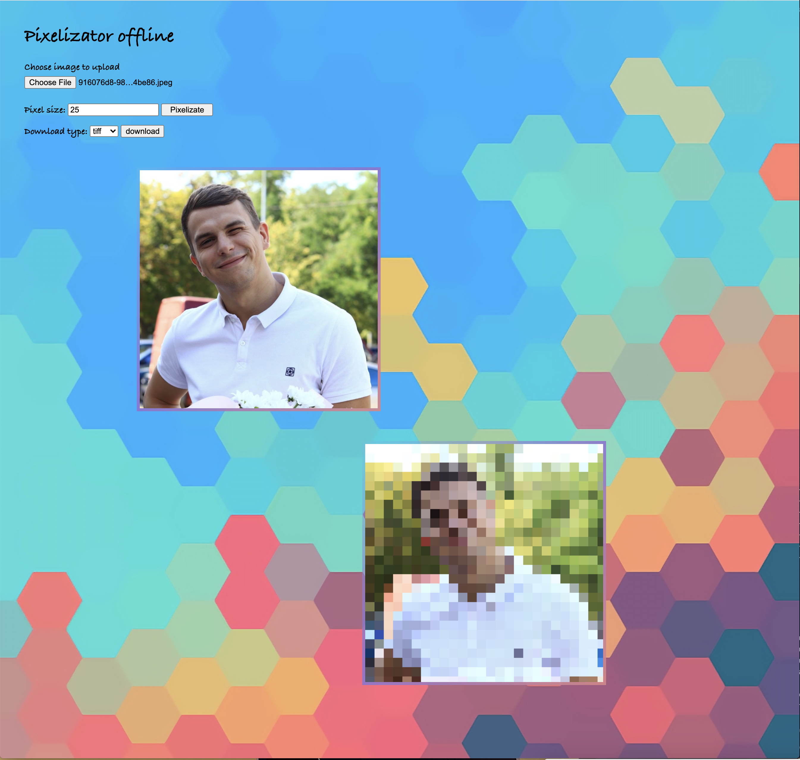

# PixyPix

The app has a web client that performs requests on the server. The server returns a pixelated version of the image back to the client.

## Technologies

Maven

Java

JavaScript

HTML5

CSS

Servlets

Fetch

## Installation

1. install tomcat7

2. git clone https://github.com/ozahirnyi/Pixelizator

3. cd Pixelizator

4. ./mvnw tomcat7:run

## Usage

1. Choose the file

2. Input Pixel size

3. Press 'Pixelizate'

## Contributing
Catch your feedbacks with pleasure :)

## License
[UCode]

## Screens

 
 
 

